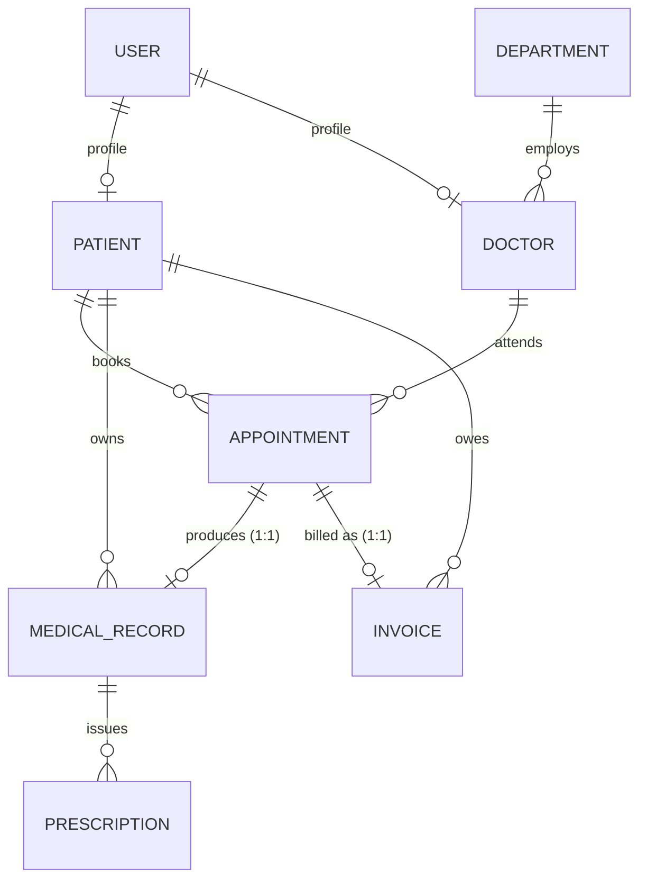

# Meridian HMS — Hospital Management System

A full-stack hospital management system with three role-specific portals sharing one API:
**patients** book and pay, **doctors** run their schedule and write clinical records, and
**administration** manages staff, departments and billing.

Built with **Node.js · Express · MongoDB (Mongoose)** on the backend and **React (Vite)** on the
frontend, secured by **JWT authentication with two-layer role- and ownership-based access control**.

The two pieces of real business logic — appointment **conflict detection** and **RBAC ownership
enforcement** — live in the service layer and are covered by tests, not sketched as stubs.

---

## Table of contents

- [Features](#features)
- [Tech stack](#tech-stack)
- [Quick start](#quick-start)
- [Environment variables](#environment-variables)
- [Demo accounts](#demo-accounts)
- [Project structure](#project-structure)
- [Data model](#data-model)
- [Access control](#access-control)
- [Appointment conflict detection](#appointment-conflict-detection)
- [Billing rules](#billing-rules)
- [API reference](#api-reference)
- [Frontend](#frontend)
- [Tests](#tests)
- [Design decisions](#design-decisions)
- [Troubleshooting](#troubleshooting)

---

## Features

**Patient**
- Public landing page and self-service registration
- Browse consultants by department, view live availability
- Book against real free slots — taken and past times are disabled in the UI *and* rejected by the API
- Cancel within the cancellation window
- Read diagnoses, vitals and prescriptions from completed visits
- View invoices and pay in full or in part

**Doctor**
- Day sheet limited to their own assigned appointments
- Mark a visit complete — this unlocks the record form and generates the invoice
- Write diagnosis, symptoms, vitals, follow-up date and prescription in one form
- Open a patient's chart only if they have a treatment relationship with them
- Publish and edit their own weekly consulting hours

**Admin**
- Hospital-wide overview: doctors, patients, departments, upcoming visits, revenue
- Provision doctor and admin accounts (creates login + profile in one step)
- Create, edit and deactivate departments
- See and cancel any appointment
- Record payments, edit line items, void unpaid invoices, track outstanding revenue

**Cross-cutting**
- JWT access/refresh tokens with transparent client-side refresh
- Zod validation on every request body, param and query
- Consistent `{ success, data, error }` response envelope
- Centralized error middleware that maps Zod, Mongoose and duplicate-key errors to clean HTTP codes
- Seed script producing a complete, demoable hospital

---

## Tech stack

| Layer | Choice |
|---|---|
| Runtime | Node.js 18+ (developed on 24) |
| API | Express 4 |
| Database | MongoDB 6+ with Mongoose 8 |
| Auth | JWT (`jsonwebtoken`) + `bcryptjs` |
| Validation | Zod |
| Security/infra | Helmet, CORS allow-list, Morgan |
| Frontend | React 18, Vite 5, React Router 6, Axios |
| State | Context API (auth) + a small `useFetch` hook (server state) |
| Styling | One hand-written CSS design-token system — no UI framework |
| Tests | Node's built-in `node:test` runner |

---

## Quick start

### Prerequisites

- **Node.js 18+** and npm
- **MongoDB** running locally on `127.0.0.1:27017`, or a MongoDB Atlas connection string

### 1. Backend

```bash
cd backend
npm install

# create your env file, then edit it if needed
cp .env.example .env        # Windows: copy .env.example .env

npm run seed                # wipes + reseeds demo data, prints the demo accounts
npm run dev                 # http://localhost:5000
```

`npm run seed` prints the demo login table when it finishes. Re-run it any time to reset
the database to a clean state.

### 2. Frontend

In a second terminal:

```bash
cd frontend
npm install
npm run dev                 # http://localhost:5173
```

The Vite dev server proxies `/api` to `http://localhost:5000`, so no CORS setup or API base
URL is needed in development.

### 3. Open the app

Visit **http://localhost:5173** and use the one-click demo buttons on the sign-in page.

### Scripts

| Location | Command | Does |
|---|---|---|
| `backend` | `npm run dev` | Start the API with nodemon |
| `backend` | `npm start` | Start the API |
| `backend` | `npm run seed` | Reset and populate demo data |
| `backend` | `npm test` | Run the unit tests |
| `frontend` | `npm run dev` | Vite dev server on :5173 |
| `frontend` | `npm run build` | Production build to `dist/` |
| `frontend` | `npm run preview` | Serve the production build |

---

## Environment variables

Copy `backend/.env.example` to `backend/.env`. The process validates this file with Zod at
boot and **refuses to start** on a bad config rather than failing later at a random request.

| Variable | Default | Purpose |
|---|---|---|
| `NODE_ENV` | `development` | `development` \| `test` \| `production` |
| `PORT` | `5000` | API port |
| `CORS_ORIGIN` | `http://localhost:5173` | Comma-separated allow-list |
| `MONGO_URI` | `mongodb://127.0.0.1:27017/hospital_management` | Connection string |
| `JWT_ACCESS_SECRET` | — | **Required**, min 16 chars |
| `JWT_REFRESH_SECRET` | — | **Required**, min 16 chars, must differ from the access secret |
| `JWT_ACCESS_EXPIRES_IN` | `1d` | Access token lifetime |
| `JWT_REFRESH_EXPIRES_IN` | `7d` | Refresh token lifetime |
| `BCRYPT_SALT_ROUNDS` | `10` | Password hashing cost |
| `DEFAULT_APPOINTMENT_MINUTES` | `30` | Fallback slot length |
| `CANCELLATION_WINDOW_HOURS` | `2` | How late a patient may self-cancel |
| `INVOICE_TAX_RATE` | `0.05` | Applied after discount |
| `INVOICE_DUE_DAYS` | `14` | Invoice due date offset |
| `SEED_PASSWORD` | `Password123!` | Password given to every seeded account |

`frontend/.env.example` holds one optional variable, `VITE_API_BASE_URL`, needed only when the
API is not reachable through the dev proxy (e.g. a deployed backend).

---

## Demo accounts

All seeded accounts share the password **`Password123!`** (configurable via `SEED_PASSWORD`).

| Role | Email | Name |
|---|---|---|
| Admin | `admin@hospital.test` | Asha Menon |
| Doctor | `doctor@hospital.test` | Dr. Alice Reed — Cardiology, Mon–Fri |
| Doctor | `doctor.neuro@hospital.test` | Dr. Ben Ortiz — Neurology, Tue/Thu/Sat |
| Doctor | `doctor.gp@hospital.test` | Dr. Chen Wu — General Medicine |
| Patient | `patient@hospital.test` | John Doe |
| Patient | `patient.maya@hospital.test` | Maya Singh |
| Patient | `patient.omar@hospital.test` | Omar Haddad |

The seed also creates 4 departments, 6 appointments spanning every status (booked, completed,
cancelled), 2 medical records with prescriptions, and 2 invoices (one paid, one partially paid) —
so every screen has something to show on first run.

**Worth trying:** sign in as `doctor.neuro@hospital.test` and open a URL belonging to
Dr. Reed's patient. The API returns 403 — ownership is enforced server-side, not by hiding buttons.

---

## Project structure

```
.
├── backend/
│   ├── src/
│   │   ├── config/            # env validation, mongoose connection
│   │   ├── models/            # 8 Mongoose schemas
│   │   ├── routes/            # 8 routers — wiring + guards only
│   │   ├── controllers/       # 7 thin controllers — parse, call service, respond
│   │   ├── services/          # 6 fat services — all business logic lives here
│   │   ├── middleware/        # auth, rbac, validate, error
│   │   ├── validators/        # Zod schemas per resource
│   │   ├── utils/             # tokens, hashing, dates, pagination, invoice math, logger
│   │   ├── seed/seed.js       # demo data
│   │   ├── app.js             # express app + middleware pipeline
│   │   └── server.js          # entrypoint, graceful shutdown
│   ├── tests/                 # node:test unit tests
│   └── .env.example
│
└── frontend/
    ├── src/
    │   ├── api/               # axios client (JWT + refresh interceptors) + per-resource modules
    │   ├── context/           # AuthContext + useAuth
    │   ├── routes/            # ProtectedRoute, RoleRoute, AppRouter
    │   ├── hooks/             # useFetch, useRole
    │   ├── components/
    │   │   ├── layout/        # Navbar, Sidebar, DashboardLayout
    │   │   ├── appointment/   # SlotPicker, AppointmentCard
    │   │   ├── medical/       # RecordCard, PrescriptionForm
    │   │   └── common/        # Table, Modal, Loader, Toast
    │   ├── pages/
    │   │   ├── Landing.jsx    # public marketing page
    │   │   ├── auth/          # Login, Register
    │   │   ├── admin/         # Dashboard, ManageDoctors, ManageDepartments, AllAppointments, Billing
    │   │   ├── doctor/        # MyAppointments, PatientRecord, WritePrescription, Availability
    │   │   └── patient/       # MyAppointments, BookAppointment, MyRecords, MyInvoices
    │   ├── utils/datetime.js
    │   └── styles.css         # the entire design system
    └── vite.config.js
```

### Request pipeline

```
Request
  → auth.middleware       verify JWT, attach req.user { id, role, patientId, doctorId }
  → rbac.middleware       capability check: may this role perform this action at all?
  → validate.middleware   Zod parse of body / params / query
  → controller            thin — unwraps req, calls the service
  → service               business rules + ownership check on the loaded document
  → model                 Mongoose
  → error.middleware      catches everything, formats one consistent error shape
```

---

## Data model



| Schema | Key fields | Notes |
|---|---|---|
| `User` | name, email, passwordHash, role, isActive | Base identity. `passwordHash` is `select: false` and stripped from JSON |
| `Patient` | userId, dob, gender, bloodGroup, address, allergies | Virtual `age` derived from `dob` |
| `Doctor` | userId, specialization, departmentId, availableSlots[] | `additionalDepartmentIds[]` gives the M:N side |
| `Department` | name, slug, description, consultationFee | Auto-slugged; virtual `doctors` |
| `Appointment` | patientId, doctorId, dateTime, durationMinutes, status | Status: `booked` \| `completed` \| `cancelled` \| `no_show` |
| `MedicalRecord` | patientId, doctorId, appointmentId, diagnosis, vitals | `appointmentId` is unique — one record per visit |
| `Prescription` | medicalRecordId, medicines[], advice | `patientId`/`doctorId` denormalized for RBAC filtering |
| `Invoice` | invoiceNumber, patientId, appointmentId, items[], totals, payments[] | `appointmentId` unique — one invoice per visit |

**Relationships that are enforced, not decorative:**

- A `MedicalRecord` can only be created from an appointment that is **completed** and belongs to
  the calling doctor — checked in `medicalRecord.service.js`.
- Cancelling an appointment **frees the doctor's slot** and **voids any unpaid invoice** for it.
- A doctor's `availableSlots` are checked against existing appointments before any booking is
  accepted — see below.

---

## Access control

Permissions resolve centrally in `services/rbac.service.js` in **two layers**. Both run on every
resource-scoped request, because a role check alone would let doctor A read doctor B's patients.

**Layer 1 — capability.** A `role → resource → actions` matrix answers "can a doctor create
medical records *at all*?" Enforced at the route via `requirePermission()`.

**Layer 2 — ownership.** Answers "is *this* record one of theirs?" Enforced in the service, which
has the loaded document:

```js
// medical record retrieval
rbac.assertAccess(user, RESOURCES.MEDICAL_RECORD, ACTIONS.READ, record);
// → doctor: record.doctorId === user.doctorId
// → patient: record.patientId === user.patientId
```

For list endpoints, ownership is folded into the **query itself** via `ownershipFilter()`, so a
patient cannot page past their own rows even by guessing ids.

| Resource | Admin | Doctor | Patient |
|---|---|---|---|
| Department | full CRUD | read | read |
| Doctor | full CRUD | read/update **own** | read (to book) |
| Patient | full CRUD | read **treated only** | read/update **own** |
| Appointment | create, read all, cancel | read/cancel/complete **own** | create/read/cancel **own** |
| MedicalRecord | read all | create/read/update **own** | read **own** |
| Prescription | read all | create/read **own** | read **own** |
| Invoice | full + payments | read **own visits** | read/pay **own** |

A doctor's "ownership" of a *patient* is a **treatment relationship**: `assertHasTreated()`
requires an appointment linking the two before the chart is served.

The frontend mirrors this with `RoleRoute`, which gates whole route subtrees — a patient typing
`/admin` in the address bar is redirected to their own dashboard, not shown a hidden-button page.

---

## Appointment conflict detection

`services/appointment.service.js → detectConflicts()` is the core of the system. It runs seven
checks in order and throws a specific error code on the first failure:

| # | Check | Error code |
|---|---|---|
| 1 | The slot is in the future | `SLOT_IN_PAST` |
| 2 | The doctor exists and is accepting patients | `DOCTOR_UNAVAILABLE` |
| 3 | The doctor publishes availability for that weekday | `OUTSIDE_AVAILABILITY` |
| 4 | The visit fits **entirely** inside one availability window | `OUTSIDE_AVAILABILITY` |
| 5 | The start time lands on the window's slot grid (no 10:07 bookings) | `INVALID_SLOT_BOUNDARY` |
| 6 | No other **booked** appointment for that doctor overlaps | `DOCTOR_DOUBLE_BOOKED` |
| 7 | The patient isn't double-booked with anyone else | `PATIENT_DOUBLE_BOOKED` |

Overlap uses **half-open intervals** `[start, end)` — an appointment ending at 10:00 does *not*
conflict with one starting at 10:00. The math lives in `utils/slotOverlapCheck.js` and is unit
tested independently of the database.

**Race conditions.** Two simultaneous requests can both pass the application-level check, so
`Appointment` carries a partial unique index as a last line of defence:

```js
appointmentSchema.index(
  { doctorId: 1, dateTime: 1 },
  { unique: true, partialFilterExpression: { status: 'booked' } }
);
```

The partial filter means cancelled and completed rows don't block re-booking a freed slot. A
duplicate-key error is translated to a clean `409 Conflict`.

**The UI can't offer what the API would reject.** `GET /api/doctors/:id/availability?date=…`
generates the slot list from the same rules, marking each slot `available` with a reason
(`booked` / `past` / `doctor_unavailable`), and `SlotPicker` renders it directly.

---

## Billing rules

- Completing an appointment **auto-generates** the invoice (consultation fee from the doctor,
  falling back to the department), so the doctor never has to touch billing.
- Generation is **idempotent** — completing twice or retrying never mints a second invoice.
- Totals: `subTotal → minus discount → plus tax → totalAmount`, all rounded to 2 decimals in
  `utils/invoiceCalculator.js`.
- Status is **derived from money received**, never set by hand:
  `pending → partially_paid → paid`, with `void` as a terminal state.
- Overpayment is rejected; partial payments are allowed and leave a running balance.
- Cancelling an appointment voids its invoice **only if nothing has been paid**.
- Invoice numbers are readable and sortable: `INV-20260812-0001`.

---

## API reference

Base URL `http://localhost:5000/api`. All protected routes take `Authorization: Bearer <token>`.

<details>
<summary><b>Auth</b></summary>

| Method | Path | Access | Description |
|---|---|---|---|
| POST | `/auth/register` | public | Self-registration — always creates a **patient** |
| POST | `/auth/login` | public | Returns user + access + refresh tokens |
| POST | `/auth/refresh` | public | Exchange refresh token for a new access token |
| GET | `/auth/me` | any | Current identity |
| POST | `/auth/logout` | any | Client-side token disposal |
| PATCH | `/auth/password` | any | Change own password |
</details>

<details>
<summary><b>Users (admin only)</b></summary>

| Method | Path | Description |
|---|---|---|
| GET | `/users` | List/search accounts by role |
| POST | `/users/staff` | Provision a doctor or admin (creates the Doctor profile too) |
| GET | `/users/:id` | One account |
| PATCH | `/users/:id/status` | Activate / deactivate |
</details>

<details>
<summary><b>Departments</b></summary>

| Method | Path | Access | Description |
|---|---|---|---|
| GET | `/departments` | any | List with doctor counts |
| GET | `/departments/:id` | any | One department + its doctors |
| POST | `/departments` | admin | Create |
| PATCH | `/departments/:id` | admin | Update |
| DELETE | `/departments/:id` | admin | Deletes, or deactivates if doctors are attached |
</details>

<details>
<summary><b>Doctors</b></summary>

| Method | Path | Access | Description |
|---|---|---|---|
| GET | `/doctors` | any | Directory — filter by department, specialty, search |
| GET | `/doctors/me` | doctor | Own profile |
| GET | `/doctors/:id` | any | One doctor |
| GET | `/doctors/:id/availability?date=YYYY-MM-DD` | any | **Generated slot list with availability flags** |
| GET | `/doctors/:id/schedule?date=` | doctor/admin | Day sheet |
| PATCH | `/doctors/:id` | admin, or own | Update profile |
| PATCH | `/doctors/:id/availability` | admin, or own | Replace weekly template |
| DELETE | `/doctors/:id` | admin | Deactivate |
</details>

<details>
<summary><b>Patients</b></summary>

| Method | Path | Access | Description |
|---|---|---|---|
| GET | `/patients` | admin all · doctor treated-only · patient self | Scoped list |
| GET | `/patients/me` | patient | Own profile + activity stats |
| GET | `/patients/:id` | ownership enforced | One patient |
| PATCH | `/patients/:id` | admin, or own | Update |
| DELETE | `/patients/:id` | admin | Deactivate |
</details>

<details>
<summary><b>Appointments</b></summary>

| Method | Path | Access | Description |
|---|---|---|---|
| POST | `/appointments` | patient, admin | **Book — runs conflict detection** |
| GET | `/appointments/me` | any | Role-aware: patient→own, doctor→assigned, admin→all |
| GET | `/appointments/:id` | ownership enforced | One appointment |
| PATCH | `/appointments/:id/cancel` | ownership enforced | Cancel + cascade |
| PATCH | `/appointments/:id/complete` | doctor (own) | Complete → generates invoice, unlocks record |

Query params: `status`, `from`, `to`, `upcoming=true`, `sort=asc|desc`, `page`, `limit`.
</details>

<details>
<summary><b>Medical records &amp; prescriptions</b></summary>

| Method | Path | Access | Description |
|---|---|---|---|
| POST | `/medical-records` | doctor | Create — **requires a completed, owned appointment** |
| GET | `/medical-records` | any | RBAC-filtered list |
| GET | `/medical-records/patient/:patientId` | ownership enforced | Patient history |
| GET | `/medical-records/:id` | ownership enforced | One record |
| PATCH | `/medical-records/:id` | doctor (own) | Amend |
| POST | `/medical-records/prescriptions` | doctor (own) | Issue a prescription |
| GET | `/medical-records/prescriptions` | any | RBAC-filtered list |
</details>

<details>
<summary><b>Billing</b></summary>

| Method | Path | Access | Description |
|---|---|---|---|
| GET | `/billing` | any | RBAC-filtered invoice list |
| GET | `/billing/summary` | admin | Billed / collected / outstanding |
| GET | `/billing/patient/:patientId` | ownership enforced | Invoices + running summary |
| POST | `/billing/:appointmentId/generate` | admin | Generate or re-issue |
| GET | `/billing/invoice/:id` | ownership enforced | One invoice |
| POST | `/billing/invoice/:id/pay` | patient (own), admin | Record a payment |
| PATCH | `/billing/invoice/:id` | admin | Edit line items, re-total |
| DELETE | `/billing/invoice/:id` | admin | Void (blocked if paid) |
</details>

**Response shapes**

```jsonc
// success
{ "success": true, "data": { }, "meta": { "page": 1, "total": 42, "totalPages": 3 } }

// failure
{ "success": false, "error": { "message": "…", "code": "DOCTOR_DOUBLE_BOOKED", "details": [] } }
```

---

## Frontend

**Routing.** `ProtectedRoute` blocks anonymous access; `RoleRoute` gates each dashboard subtree by
role. Public routes: `/` (landing), `/login`, `/register`.

| Role | Routes |
|---|---|
| Admin | `/admin`, `/admin/doctors`, `/admin/departments`, `/admin/appointments`, `/admin/billing` |
| Doctor | `/doctor`, `/doctor/availability`, `/doctor/patients/:patientId`, `/doctor/appointments/:appointmentId/record` |
| Patient | `/patient`, `/patient/book`, `/patient/records`, `/patient/invoices` |

**Auth state** lives in `AuthContext` (user, role, tokens) and persists to `localStorage`. The
Axios client attaches the bearer token, and on a `401` performs a **single-flight refresh** — a
burst of parallel requests triggers exactly one refresh call, then all retry.

**Server state** uses a small `useFetch(fetcher, deps)` hook returning
`{ data, meta, loading, error, refetch }`.

**Design system.** One stylesheet, `src/styles.css`, driven entirely by CSS custom properties:
a 4/8/16/24/32 spacing scale, four type sizes, and a fixed palette. Status colour is used
consistently everywhere state appears — green for completed/paid, amber for booked/pending, red
for cancelled/void — as an indicator dot on badges and as the left rail on appointment cards.

---

## Tests

```bash
cd backend
npm test
```

15 unit tests across three suites, no database required:

- `tests/slotOverlap.test.js` — interval overlap, slot-grid expansion, window fitting
- `tests/invoiceCalculator.test.js` — totals, discount capping, payment-status derivation
- `tests/rbac.test.js` — capability matrix, ownership resolution, query-level scoping

The full request flow was additionally verified end-to-end against a live server and database
(booking, double-booking rejection, off-grid and past-date rejection, cross-doctor record access
denial, completion → invoice, partial payment, overpayment rejection, cancellation cascade,
token refresh and staff provisioning).

---

## Design decisions

Choices made where the spec left room, and why:

1. **Everything is UTC.** Doctor availability is stored as `"HH:mm"` strings interpreted in UTC and
   appointments as UTC instants, so conflict detection is deterministic wherever the server runs.
   The UI labels times "UTC" rather than pretending otherwise. A production build would store an
   IANA timezone per clinic — deliberately out of scope.
2. **Registration only creates patients.** Doctor and admin accounts are provisioned by an admin
   through `POST /users/staff`; otherwise anyone could self-promote by posting `role: "admin"`.
3. **Availability is a weekly template, not per-date exceptions.** Simple and demoable; holidays
   and leave would need a separate exceptions collection.
4. **Doctors don't "own" patients — treatment relationships do.** A chart opens only if an
   appointment links the two, which is why `assertHasTreated()` exists.
5. **Auto-invoicing on completion is a system action.** Doctors have no `create` capability on
   invoices, so the completion flow calls the billing service with an internal `system` flag
   rather than widening the doctor role.
6. **A failed invoice must not roll back a completed visit.** Invoice generation is wrapped and
   logged; the clinical record of the visit takes precedence.
7. **Soft delete over hard delete.** Departments with doctors are deactivated; doctors and
   patients are deactivated via their user account. Cancelled appointments are kept for audit.
8. **Registration uses a transaction with a fallback.** Creating `User` + `Patient` runs in a
   Mongoose transaction, but standalone `mongod` has no transactions — so it falls back to
   sequential writes with manual compensation on failure.
9. **Notifications are a logging stub.** `notification.service.js` has the full call sites
   (booked / cancelled / completed / invoiced); swapping in Nodemailer or a queue means changing
   one `deliver()` function.
10. **No React Query.** Context plus a small `useFetch` hook keeps the dependency surface minimal
    and the data flow obvious for a project this size.

### Known limitations

- Stateless JWT logout — no server-side refresh-token denylist
- No file uploads (scans, reports) or PDF invoice export
- No pagination UI on the frontend, though the API paginates everywhere
- Notifications are logged, not delivered

---

## Troubleshooting

| Symptom | Fix |
|---|---|
| `Invalid environment configuration` on boot | Copy `.env.example` to `.env`; both JWT secrets need 16+ chars |
| `MongoDB connection failed` | Start MongoDB, or point `MONGO_URI` at Atlas |
| Frontend loads but every call 401s | Backend isn't running on :5000 — the Vite proxy has nothing to reach |
| CORS error in the console | Add your origin to `CORS_ORIGIN` (comma-separated) |
| "That slot was just taken" | Working as intended — the unique index caught a concurrent booking |
| Demo logins fail | Run `npm run seed`; check `SEED_PASSWORD` matches what you're typing |
| All slots show "PAST" | Availability is UTC — pick tomorrow, or a weekday the doctor consults |

---

## License

MIT — provided as a portfolio/demonstration project. Not a certified medical record system; do
not use it with real patient data.
